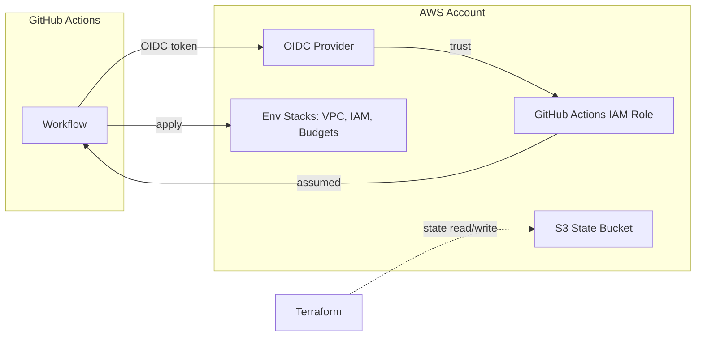

# Architecture

## Repository Layout

| Path | Description |
| --- | --- |
| `bootstrap/account/` | Account setup: the shared OIDC provider for GitHub Actions |
| `environments/test/` | Test environment: the IAM role and the VPC, IAM, and budget stacks |
| `modules/oidc-provider/` | Reusable OIDC provider and IAM role module |
| `docs/` | Setup, architecture, security, and verification guidance |
| `config/` | Environment-to-account mapping in `environments.json` |
| `scripts/` | Setup and cleanup helper scripts |
| `.github/workflows/` | CI/CD and documentation workflows |

## Bootstrap Stack (`bootstrap/account`)

- Creates the GitHub Actions OIDC provider (`token.actions.githubusercontent.com`) unless an existing provider is reused.
- The provider is shared across account stacks.

## Environments (`environments/test`)

- Root config consumes `modules/oidc-provider` to create the `GitHubActionsServiceRole-Terraform` role.
- The role trust policy allows `sts:AssumeRoleWithWebIdentity` for the repository subject with audience `sts.amazonaws.com`.
- Additional roots describe the deployed VPC, IAM users/groups, and budgets, imported from live state.

## Remote State

- S3 bucket in `us-east-1`, server-side encrypted (AES256), versioning enabled, native `.tflock` locking.
- Each root uses an explicit key:

| Root | State key |
| --- | --- |
| `bootstrap/account` | `bootstrap/account/terraform.tfstate` |
| `environments/test` | `environments/test/terraform.tfstate` |

Every root must set an explicit `key`. Without one, Terraform uses `terraform.tfstate`, so different roots could share the same state.

## OIDC Trust Flow

1. GitHub Actions requests a signed OIDC token for the job.
2. AWS is asked to exchange the token via `sts:AssumeRoleWithWebIdentity`.
3. The IAM role trust policy validates subject (`repo:<owner>/<repo>:*`) and audience (`sts.amazonaws.com`).
4. The workflow receives temporary credentials and deploys without static keys.
